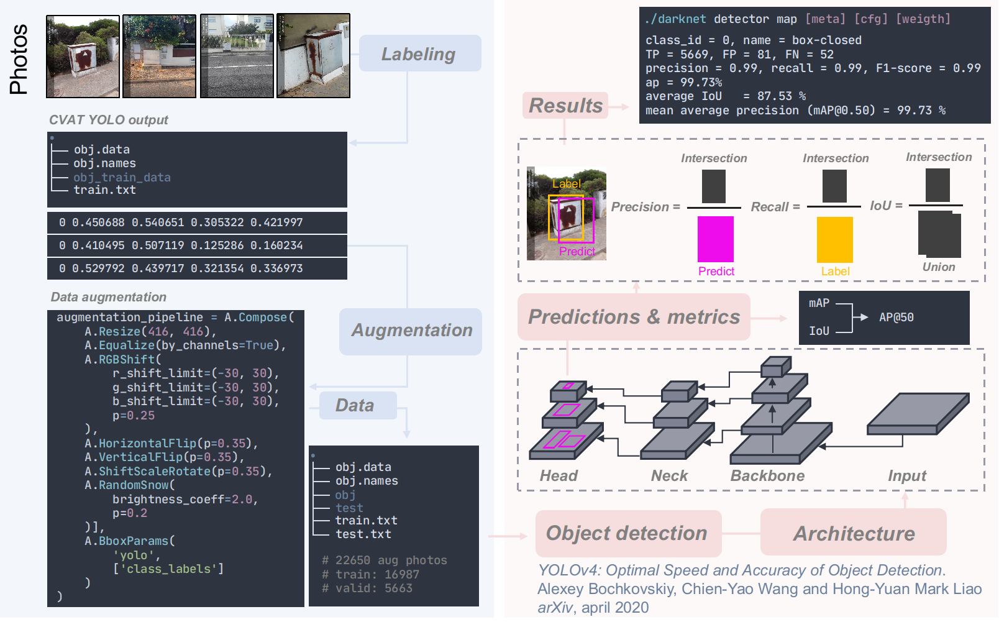

# EDP electronic boxes detection and classification using AI


## Prototype Scope Definition

Use artificial intelligence approaches to be able to detect the EDP electronic boxes from photos and assess the presence of any alterations. Based on this the ultimate goal is to guide the company in the decision making process related to the continuous maintenance of the boxes. 

### A. *In scope*

In this project we set two main goals: detect the EDP boxes and evaluate their states. In this regard we used a dataset generated by the company that contains **NUMBER OF TOTAL** photos. The photos depicted several situations (i.e., zoom on the corner, zoom inside, zoom on the lock, zoom on the boxes, far from the boxes). In the frame of this proof-of-concept we focus on our ability to establish a workflow that yield an optimal baseline to (i) detect the EDP electronic boxes and (ii) assess their global states. Consequently and for the purpose of this, we decided to focus on photos where the full / part of the boxes were depicted. This leads us to use of 303 photos from the dataset. Discussion and perspectives will be proposed at the end of this report to both improve our approach and tackle the problems risen by the other 200 photos.

The global approach used here aims at fulfilling the following objectives:

- Detect the boxes in each photos using deep learning
- Cropping out the boxes and save the new pictures
- Used the cropped picture to feed a deep learning classification model that will determine the state of the EDP electronic box (**for Samuel**).

### B. *Out of scope*

In this proof-of-concept we did not investigate the ability to detect different form of alterations (i.e., oxidation, cracks, opened doors). As we will talk in the perspectives of this work, tackling this kind of questions rely on the use more advanced computer vision techniques as semantic or instance image segmentations.

## Documentation

### A. *Problem definition*

### B. *Tasks to be implemented*

To tackle our goal we articulated the project into 3 steps:

- Label the photos and process them with different steps of data augmentations
- Train and establish a baseline for the detection of EDP boxes using training and validation sets
- Train and establish a baseline for the classification of the state of EDP boxes using training and validation sets

### C. *Proposed approach*

#### Data collection and processing

In this project we aim at the identification of 1 class of object: EDP electronic box. In total we got 303 images. The Computer Vision and Annotation Tool ([CVAT](https://github.com/openvinotoolkit/cvat)) has been used to label the images and export the bounding boxes data in YOLO format.

```bash
# Example of labeling data in YOLO format

Class Index     x          y          width      height
---------------------------------------------------------
0   			0.438271   0.523156   0.179000   0.191354

# Classes are 0 indexed
# x and y are the coordinates of the center point of the bounding box
# Values are normalized regarding size of the image
```

We used traditional transformations that combined affine image transformations and color modifications. These transformations have been performed using the [Albumentations](https://github.com/albumentations-team/albumentations) python library. This library leverages `numpy`, `opencv` and `imgaug` python libraries through an easy to use API. The sequence of transformations can be seen below in the code snippet.

```python
A.Compose(
    [A.Resize(416, 416),
     A.Equalize(by_channels=True),
     A.RGBShiftr_shift_limit=(-30, 30), g_shift_limit=(-30, 30), b_shift_limit=(-30, 30), p=0.25),
     A.HorizontalFlip(p=0.35),
     A.VerticalFlip(p=0.35),
     A.ShiftScaleRotate(border_mode=cv2.BORDER_REPLICATE, p=0.35),
     A.RandomSnow(brightness_coeff=2.0, p=0.2)],
     A.BboxParams('yolo', ['class_labels'])
    )
```

Each image went through 75 distinct rounds of transformations which brings the total number of images to 22725. Our images have been spitted into training and validation sets at a `0.75|0.25` ratio. 

#### EDP boxes detection model training with YOLOv4

For EDP boxes detection we used the YOLOv4 architecture whom backbone network is based on the CSPDarknet53 ResNet. YOLO is a one-stage detector meaning that predictions for object localization and classification are done at the same time. Additionally and through its previous iterations the model significantly improves by adding Batch-norm, higher resolution, anchor boxes, objectness score to bounding box prediction and a detection in three granular step to improve the detection of smaller objects. From the user perspective YOLO proved to be very easy to use and setup. Indeed because of the time restriction when using the Google Colab free tier we decided to install locally all necessary drivers (NVIDIA, CUDA) and compile locally the [Darknet architecture](https://github.com/AlexeyAB/darknet). This has been done on a Linux computer running Ubuntu 20.04, with 32GB of RAM, NVIDIA GeForce GTX1060 graphic card with 6GB memory and an Intel i7 processor.

To evaluate the model we relied on two metrics: the **mean average precision** (mAP) and the **intersection over union** (IoU). The **average precision** (AP) is a way to get a fair idea of the model performance. It consists of computing the maximum precision we can get at different threshold of recall. Then we calculate the mean of these maximum precision. If we had several classes we need to get the AP for each class and then compute the mean again. This is why this metric is named **mean average precision**. In our case because we only have on class AP and mAP are equals. Object detection brings an additional complexity: what if the model detects the correct class but at the wrong location meaning that the bounding box is completely off. Surely this prediction should not be counted as positive. That is where the IoU comes handy and allows to determine whether the bounding box is located at the right location. Usually a threshold of 0.5 is set and results above are considered as good prediction. As such the corresponding mAP is noted as **mAP@0.5**. After training we assess the accuracy of our model on a validation set. Doing so revealed that our model yielded a mAP with a IoU threshold of 50% of 99.7%.  Our complete workflow for object detection is depicted in Figure X



For predictions we built a python class that encapsulate the `openCV` backend for YOLO. Predictions were ran on CPU. In practice running the predictions on raw images yielded 95% of efficacy to detect the EDP boxes (8 images yielded inaccurate predictions and other had the good prediction but the bounding box was ex-centered). When a prediction succeeds the image is saved and after the frame undergoes a cropping step to extract the pixels inside the predicted box. See Figure 3 for a representative set of predictions and crops.


*Figure 4: Representative results obtain from our object detection model*

#### EDP boxes classification with TensorFlow (Samuel)

## Summary and perspective

